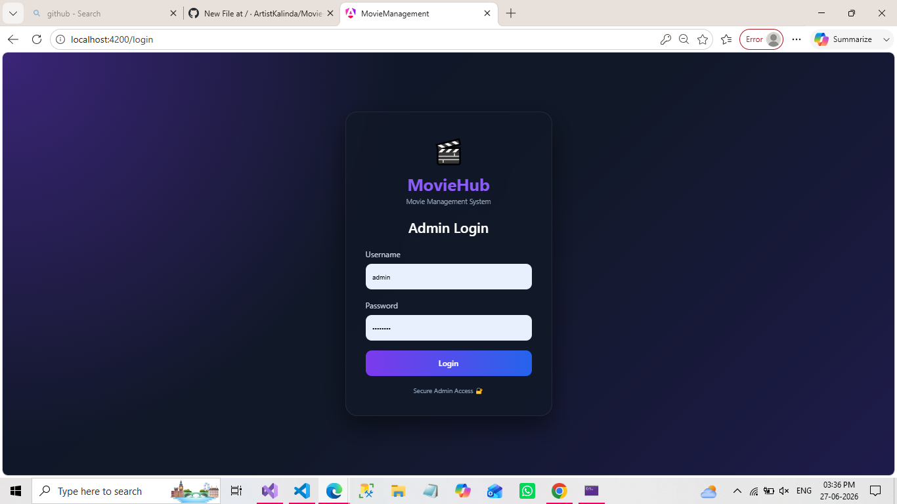
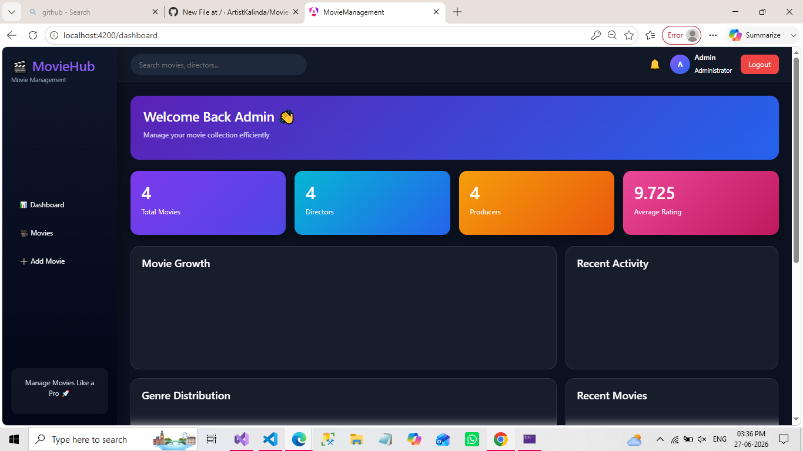
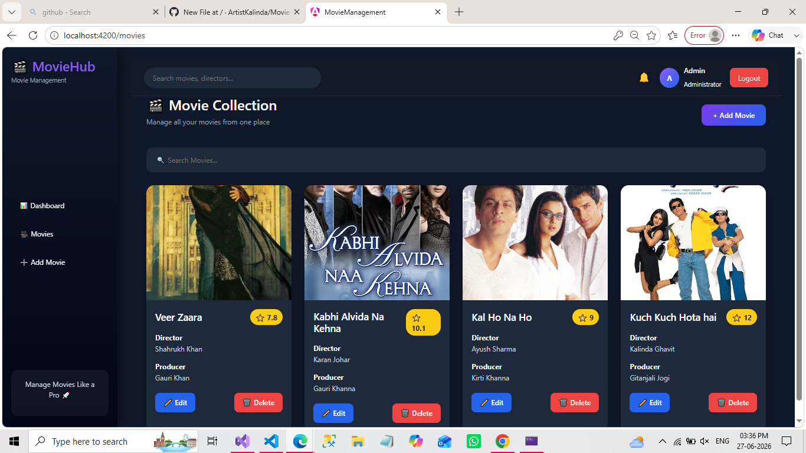
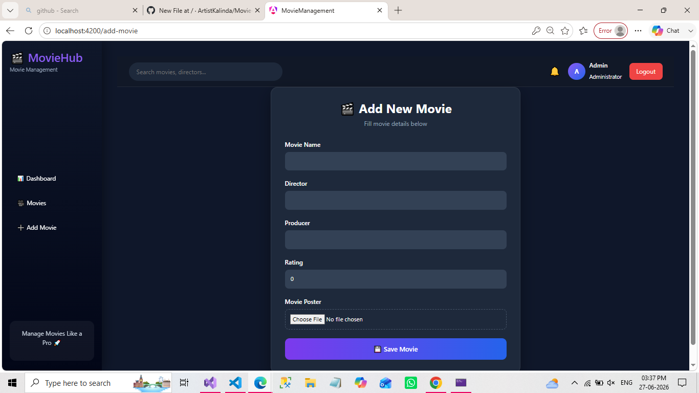
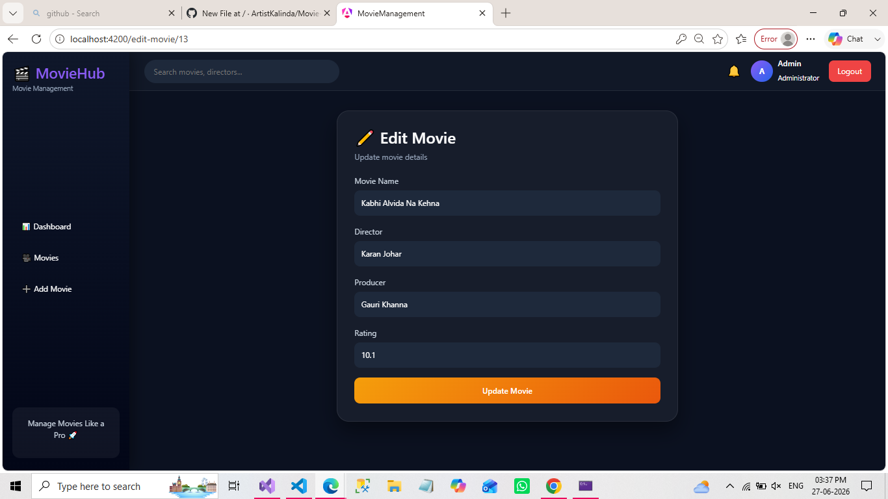

# 🎬 Movie Management System - Frontend

A modern Movie Management System built using **Angular 18** with JWT Authentication, Dashboard Analytics, CRUD Operations and Responsive UI.

---

## 📌 Project Overview

This project is the frontend of the **Movie Management System**.

It allows administrators to securely manage movie records through a modern dashboard interface.

The application communicates with an ASP.NET Core Web API using JWT Authentication.

---

# ✨ Features

* 🔐 Admin Login using JWT Authentication
* 📊 Dashboard with Live Statistics
* 🎬 Add New Movie
* ✏️ Update Existing Movie
* 🗑 Delete Movie with Confirmation
* 🔍 Search Movies
* ⭐ Movie Rating
* 🖼 Movie Poster Support
* 🎨 Responsive Modern UI
* 🚀 SweetAlert2 Notifications
* 🔒 Route Protection using Auth Guard
* 🔑 HTTP Interceptor for JWT Token

---

# 🛠 Tech Stack

| Technology  | Version |
| ----------- | ------- |
| Angular     | 18      |
| TypeScript  | Latest  |
| Bootstrap   | 5       |
| SweetAlert2 | Latest  |
| ng2-charts  | Latest  |
| RxJS        | Latest  |

---

# 📁 Project Structure

```
src
│
├── app
│   ├── components
│   ├── layout
│   ├── services
│   ├── models
│   ├── guards
│   ├── interceptors
│   └── pages
│
├── assets
│
└── environments
```

---

# 📸 Screenshots

Add screenshots inside a folder named:

```
Screenshots
```

Example

```
Screenshots

login.png

dashboard.png

movie-list.png

add-movie.png

edit-movie.png
```

Then display them here.

### Login



---

### Dashboard



---

### Movie List



---

### Add Movie



---

### Edit Movie



---

# ⚙ Installation

Clone Repository

```bash
git clone https://github.com/ArtistKalinda/Movie-Management.git
```

Install Packages

```bash
npm install
```

Run Project

```bash
ng serve
```

Application URL

```
http://localhost:4200
```

---

# 🔗 Backend Repository

ASP.NET Core Web API

https://github.com/ArtistKalinda/MovieManagement.API

---

# 👩‍💻 Author

**Kalinda Ghavit**

BSc Computer Science Student

GitHub

https://github.com/ArtistKalinda

---

# ⭐ If you like this project

Please give it a ⭐ on GitHub.
